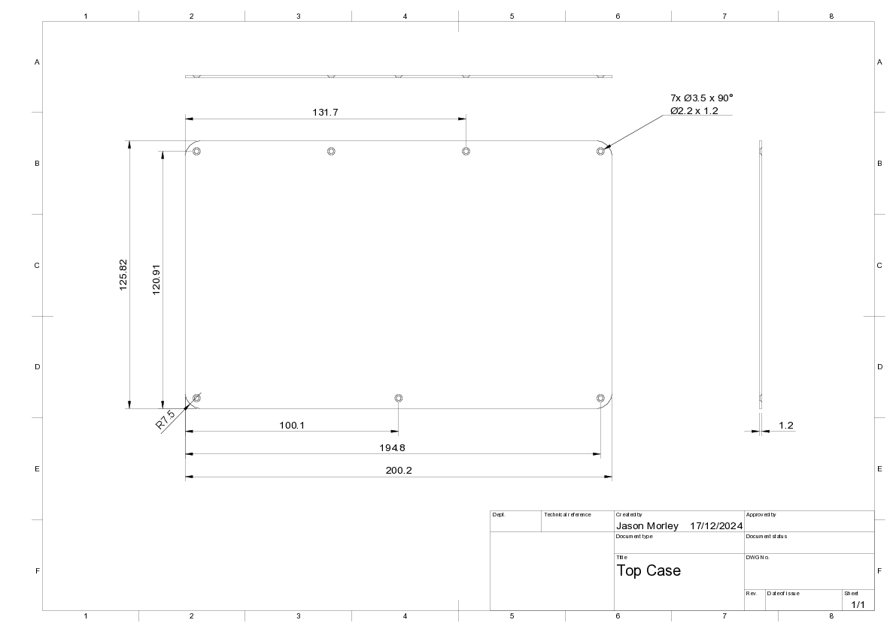

# Pocket Reform Backplate

Replacement aluminum CNC backplate for the [MNT Pocket Reform](https://shop.mntre.com/products/mnt-pocket-reform)

This is my own part based heavily on [pandora's](https://community.mnt.re/t/solving-heat-related-issues-with-custom-lid/2809/8) beautiful [replacement backplate](https://github.com/FesixGermany/mnt_pocket_reform_backplate) that seems to significantly improve the Pocket Reform's thermals.

## Technical Drawing

## Manufacture

I ordered my version from [PCBWay](https://www.pcbway.com) using their [CNC Machining](https://www.pcbway.com/rapid-prototyping/manufacture/?type=1) service.

To order using this service you'll need to provide them with the following files:

- Model—[backplate.step](backplate.step)
- Technical Drawing—[backplate.pdf](backplate.pdf)

There are also a collection of detailed questions you'll need to provide answers to. The defaults are fine for most of them. The following seems to work well:

| Option                   | Selection                                                    |
| :----------------------- | ------------------------------------------------------------ |
| Material                 | Aluminum 6061                                                |
| Process                  | -                                                            |
| Threads and Tapped Holes | No                                                           |
| Applications             | -                                                            |
| Inserts                  | No                                                           |
| Parts assembly           | No                                                           |
| Product description      | Office Appliance and Accessories >>Computer Enclosure        |
| Part tracking            | -                                                            |
| Quantity                 | 1                                                            |
| Color                    | Silver white                                                 |
| Surface finish           | Anodized - Bead blast + Anodized color - Purple              |
| Tolerance                | No tighter tolerances required (ISO 2768-1)                  |
| Inspection               | Standard Inspection (No report)                              |
| Hardness                 | -                                                            |
| Finished appearance      | Standard                                                     |
| Other special request    | Please countersink the holes to 3.5mm 90 degrees, as per the technical drawing. Thank you. |

